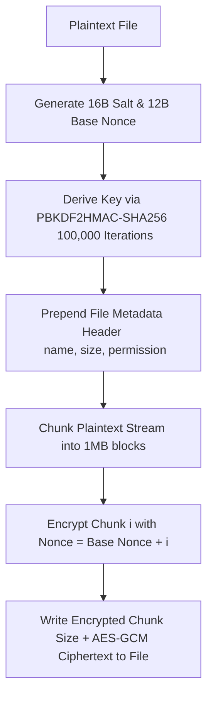

# SecureFile – Advanced File Encryption & Decryption System

SecureFile is a desktop application written in Python 3. It utilizes CustomTkinter for GUI components, SQLite for action logs and configurations database, and cryptography library bindings to implement AES-256 GCM authenticated file encryption. It was developed as a college project for the Operating Systems course, showcasing process management, storage scheduling, file permission handling, and telemetry interfaces.

---

## Objectives
1. **Secure File Lifecycle**: Implement authenticated, cryptographically sound encryption and decryption operations that run in non-blocking environments.
2. **Demonstrate OS Core Theories**: Map file system management, multithreaded process orchestration, memory usage profiling, permissions, and storage verification to concrete UI indicators.
3. **Security-First Approach**: Refrain from using mock patterns (such as XOR/Base64 masking) in favor of standards-compliant PBKDF2-HMAC password hashing and GCM authenticated decryption.

---

## Features

- **Cybersecurity Dark Aesthetic**: Custom UI colors featuring slate foundations, warning alerts, progress indicators, status badges, and collapsible file details.
- **Brute-Force Attack Deterrence**: Automated failed-login rate-limiting. Stores brute-force penalty lockout states inside SQLite database to prevent bypasses by restarting the application.
- **Chunked AEAD Encryption (AES-GCM)**: Encrypts files of any size without RAM spike issues by processing files in 1MB streams, verifying tag authenticity for each block.
- **Data Privacy**: Packs the original file extensions, exact sizes, and file permissions directly into the encrypted container. An external observer cannot see original filenames from the `.secure` file.
- **Secure File Registry**: Active files view showing original size, encrypted size, and file locations. Includes options to decrypt in-place or locate files in Windows File Explorer.
- **Audit Logging System**: Keeps database logging of actions (encryption, decryption, failures, logins). Includes filters, DB truncation tools, and CSV log exporter.
- **Live System Monitor Widget**: Dynamic updating of system diagnostics: global CPU percentage, virtual memory usage, processes, thread pool sizes, and active process handles.

---

## Operating System Concepts Demonstrated

### 1. File Management
- **File System Operations**: Implements operations to create, read, write, and delete files on disk safely.
- **Permission Bitmasks**: Reads and displays Unix-style octal file modes (e.g. `0o644` / `0o755`) and Windows Read/Write indicators via `os.stat`. Restores original permission states when a file is decrypted.

### 2. Process & Thread Management
- **Worker Threading**: Moves disk-heavy and processor-intensive encryption tasks onto dedicated worker threads (`threading.Thread`). This prevents locking or freezing the tkinter event loop.
- **Process Telemetry**: Monitors active threads inside the app using `psutil` process maps, displaying the CPU cycles and memory usage of the current program process.

### 3. Storage Management
- **Pre-flight Capacity Checks**: Computes destination folder sector bounds via `shutil.disk_usage` before running processes to prevent full disk lockups.
- **Storage Metrics**: Aggregates original file sizes and encrypted files sizes dynamically, calculating the volume of storage protected.

### 4. Resource Allocation Diagnostics
- **Context Handlers**: Ensures files and SQLite stream descriptors are closed correctly under failure conditions using `with` context blocks.
- **OS Handle Tracking**: Polls active file descriptors (`proc.num_fds`) on Unix or active handles (`proc.num_handles`) on Windows to detect resource leakages.

---

## Cryptographic Design & Architecture



### 1. Key Derivation (KDF)
To convert variable-length user passwords into 256-bit AES keys, we utilize a Password-Based Key Derivation Function (PBKDF2):
- **Algorithm**: PBKDF2HMAC-SHA256
- **Salt**: 16-byte cryptographically secure random bytes (`os.urandom(16)`)
- **Iteration Count**: 100,000 rounds
- **Output Length**: 32 bytes (256 bits)

### 2. Authenticated Encryption Format
The output file with extension `.secure` is structured as follows:
1. **Container Identifier**: `SF` (2 bytes)
2. **Version**: `\x01` (1 byte)
3. **Key Derivation Salt**: (16 bytes)
4. **Base Nonce**: (12 bytes)
5. **Payload Chunks**: For each 1MB block:
   - *Chunk Size*: 4 bytes (big-endian integer)
   - *AES-GCM Ciphertext*: Contains the plaintext data chunk + 16-byte authentication tag appended by the AEAD cipher.

*Note: The first block decrypted contains the encrypted metadata header containing filename length, UTF-8 filename, original file size, and permission bits.*

---

## Installation & Setup

### Prerequisites
- Python 3.9 or higher (Ensure Python is added to the system PATH).
- Virtual environment tool (`venv`) enabled.

### Installation Instructions
1. Navigate to the project root directory.
2. Activate your Python virtual environment.
   - **Windows (Command Prompt)**: `.venv\Scripts\activate.bat`
   - **Windows (PowerShell)**: `.venv\Scripts\activate.ps1`
   - **macOS / Linux**: `source .venv/bin/activate`
3. Install the dependencies listed in `requirements.txt`:
   ```bash
   pip install -r SecureFile/requirements.txt
   ```

---

## How to Run & Test
Execute the application from the project root using the python command:
```bash
python SecureFile/main.py
```

### Default Demo Credentials
- **Username**: `admin`
- **Password**: `Admin@123`

> [!WARNING]
> Please change this default password from the **Settings** panel on your first launch.

---

## Database Design (SQLite)

The application database `securefile.db` is stored under `SecureFile/data/` and contains the following schema:

```
users (
    id INTEGER PRIMARY KEY,
    username TEXT UNIQUE,
    password_hash TEXT,
    failed_logins INTEGER,
    lockout_until REAL
)

files (
    id INTEGER PRIMARY KEY,
    filename TEXT,
    encrypted_path TEXT UNIQUE,
    original_size INTEGER,
    encrypted_size INTEGER,
    encryption_date TEXT,
    status TEXT
)

activity_logs (
    id INTEGER PRIMARY KEY,
    timestamp TEXT,
    username TEXT,
    filename TEXT,
    operation TEXT,
    original_size INTEGER,
    result TEXT,
    duration REAL
)

settings (
    key TEXT PRIMARY KEY,
    value TEXT
)
```

---

## Future Enhancements
- **Multi-Factor Authentication (MFA)**: Support TOTP authentication codes for administrative logins.
- **Hardware-Accelerated Crypto**: Integrate AES-NI instructions using direct C bindings for cryptographic operations.
- **Cloud Safe Syncing**: Support auto-uploading `.secure` files to Amazon S3 or Google Drive API buckets.
